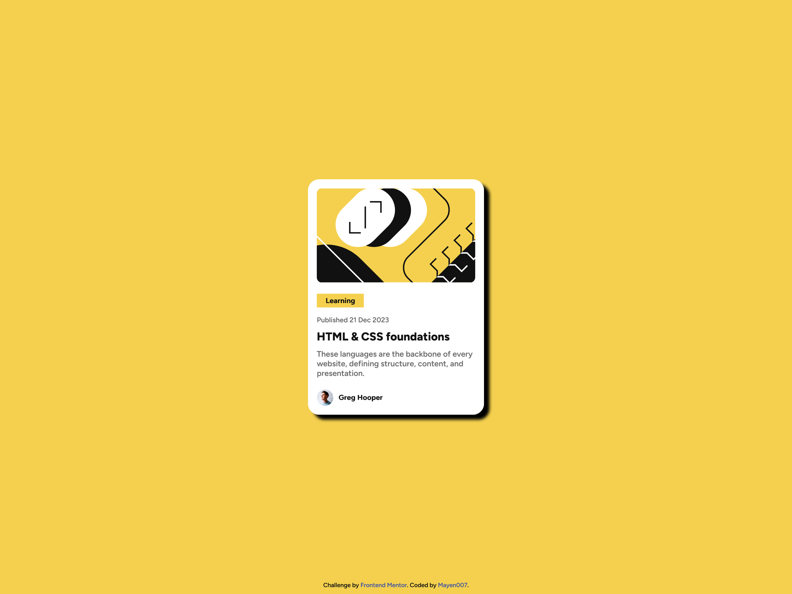

# Frontend Mentor - Blog Preview Card Solution

This is a solution to the [Blog preview card challenge on Frontend Mentor](https://www.frontendmentor.io/challenges/blog-preview-card-ckPaj01IcS). Frontend Mentor challenges help you improve your coding skills by building realistic projects.

## Table of Contents

- [Overview](#overview)
  - [The Challenge](#the-challenge)
  - [Screenshot](#screenshot)
  - [Links](#links)
- [My Process](#my-process)
  - [Built With](#built-with)
  - [What I Learned](#what-i-learned)
  - [Continued Development](#continued-development)
  - [Useful Resources](#useful-resources)
- [Author](#author)

## Overview

### The Challenge

Users should be able to:

- View a visually appealing blog preview card component with a title, image, description, author information, and hover effects.
- Experience responsive styling that adapts to different screen sizes.
- See hover and focus states for interactive elements like the article title link.

### Screenshot




### Links

- **Solution URL:** [GitHub Repository](https://github.com/Mayen007/blog-preview-card)
- **Live Site URL:** [Live Preview](https://mayen007.github.io/blog-preview-card)

## My Process

### Built With

- **Semantic HTML5** for structured and meaningful content.
- **CSS Custom Properties** for easier color management and theme adjustments.
- **Flexbox** for responsive and flexible layout design.
- **Mobile-first workflow** to ensure a seamless experience on various devices.
- **Custom Fonts (Figtree)** for a unique and consistent typography style.

### What I Learned

During this project, I applied custom fonts and CSS properties to create a clean and visually appealing design. Here are a few key takeaways:

1. **CSS Custom Properties**: Using variables for colors made it easy to maintain consistency and quickly update the theme.
2. **Flexbox**: Utilizing Flexbox simplified the layout and alignment of elements, especially for the avatar profile section.
3. **Font Integration**: I integrated custom fonts (`Figtree-ExtraBold` and `Figtree-SemiBold`) to enhance the typography of the blog card.

#### Code Snippets:

**CSS Variables for Theme Management:**

```css
:root {
  --yellow-bg: hsl(47, 88%, 63%);
  --white: hsl(0, 0%, 100%);
  --gray-500: hsl(0, 0%, 42%);
  --gray-950: hsl(0, 0%, 7%);
}
```

### Avatar Profile Section with Flexbox

To create a clean and aligned avatar section, I utilized Flexbox. This approach allowed for easy alignment of the author's image and name.

#### HTML:

```html
<div class="avatar-profile">
  
  <address class="author">Greg Hooper</address>
</div>
```

```CSS
.title {
  font-size: 1.3rem;
  color: var(--gray-950);
  text-decoration: none;
  transition: color 0.3s ease;
}

.title:hover {
  color: var(--yellow-bg);
}
```

### Continued Development

For future projects, I aim to focus on:

- **CSS Grid**: To experiment with more advanced and varied layouts, providing greater flexibility in the design process.
- **Accessibility Improvements**: Enhancing screen reader support and keyboard navigation to ensure an inclusive experience for all users.
- **JavaScript Enhancements**: Incorporating JavaScript for dynamic interactions to create a more engaging user experience.

### Useful Resources

- [MDN Web Docs](https://developer.mozilla.org/) - A comprehensive guide and reference for HTML, CSS, and JavaScript, offering detailed explanations and examples.
- [CSS-Tricks Flexbox Guide](https://css-tricks.com/snippets/css/a-guide-to-flexbox/) - This guide helped me improve my understanding of Flexbox for responsive design.
- [Google Fonts](https://fonts.google.com/) - A great resource for selecting and integrating custom fonts into the project, enhancing the visual appeal.

## Author

- **GitHub** - [Mayen007](https://github.com/Mayen007)
- **Frontend Mentor** - [Mayen007](https://www.frontendmentor.io/profile/Mayen007)

## Acknowledgments

Special thanks to **Frontend Mentor** for providing this challenge. I also appreciate the resources like **MDN Web Docs** and **CSS-Tricks** for their valuable insights and support throughout the development process.
